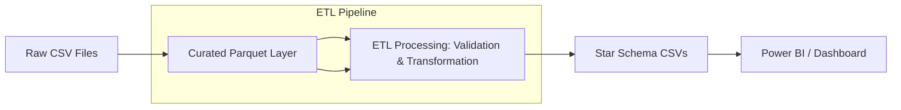

# Finance ETL Pipeline

<p align="center">
  <a href="https://github.com/Chezhira/Finance-ETL-Pipeline-Monthly-Close-Dataset">
    
  </a>
  
  
  
  
  
</p>

---

## 🌟 Project Highlights
- ✅ **Portfolio-grade ETL pipeline** for monthly financial close.
- ✅ **Validated, curated Parquet datasets** for dashboards and FP&A.
- ✅ **Star-schema outputs** for BI tools (Power BI, Tableau).
- ✅ **Built-in data quality checks** and KPI calculations.
- ✅ **CI/CD with linting, formatting, tests, and security audit**.
- ✅ **Pre-commit hooks** to keep code clean locally.
- ✅ **Modern Python tooling**: Ruff, Black, pytest, GitHub Actions.

---

## 📌 Overview
A **data engineering mini-project** that turns messy monthly finance extracts into **validated, curated datasets** ready for analytics.

---

## 🏗 Architecture



---

## 🚀 Quickstart

```bash
# Clone repo
git clone https://github.com/Chezhira/Finance-ETL-Pipeline-Monthly-Close-Dataset.git
cd Finance-ETL-Pipeline-Monthly-Close-Dataset

# Install dependencies
pip install -e .
pip install -r requirements-dev.txt

# Generate synthetic data
python scripts/generate_synthetic_data.py --month 2025-12 --out-dir data/raw

# Run ETL pipeline
finance-etl run --month 2025-12
```

---

## 🔄 How to Run (Cross-Platform)

### **Linux/macOS**
Use the provided **Makefile**:
```bash
make setup        # Install dependencies
make lint         # Lint code
make format       # Format code
make test         # Run tests
make run MONTH=2025-12  # Run ETL for December 2025
```

### **Windows**
Use the PowerShell task runner:
```powershell
powershell -NoProfile -ExecutionPolicy Bypass -File .	asks.ps1 setup
powershell -NoProfile -ExecutionPolicy Bypass -File .	asks.ps1 lint
powershell -NoProfile -ExecutionPolicy Bypass -File .	asks.ps1 run -Month 2025-12
```

---

## 🎯 Demo Workflow (Job Showcase)
1. **Generate synthetic data**:
   ```powershell
   powershell -File .	asks.ps1 data -Month 2025-12
   ```
2. **Run ETL pipeline**:
   ```powershell
   powershell -File .	asks.ps1 run -Month 2025-12
   ```
3. **Check outputs**:
   - `data/curated/*.parquet`
   - `data/output/*.csv` (Star schema for BI tools)

---

## 📜 Data Contracts
* **fact_transactions.parquet** → GL transactions
* **dim_accounts.parquet** → Chart of accounts
* **kpi_monthly.parquet** → KPI metrics

---

## ✅ Data Quality Controls
* Null checks
* Referential integrity (entity/account keys)
* KPI consistency checks

---

## 📊 Outputs & KPIs
* **Star schema CSVs:** `dim_date.csv`, `dim_month.csv`, `dim_entity.csv`, `dim_account.csv`, `fact_gl.csv`, `fact_kpi_monthly.csv`
* KPIs: Revenue, Expense, Gross Margin %, Operating Margin %

---

## 🤝 Contributing
Pull requests are welcome!Run `pre-commit run --all-files` before committing to keep CI green.

---

## 📄 License
MIT License © 2026 Chez Solutions
